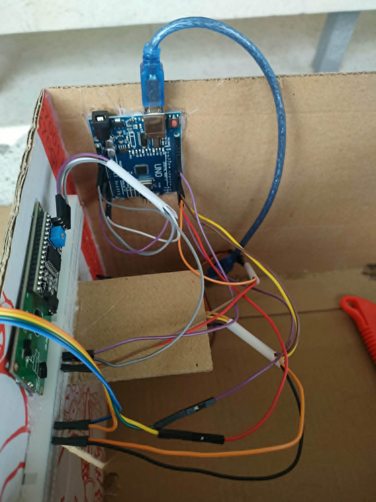
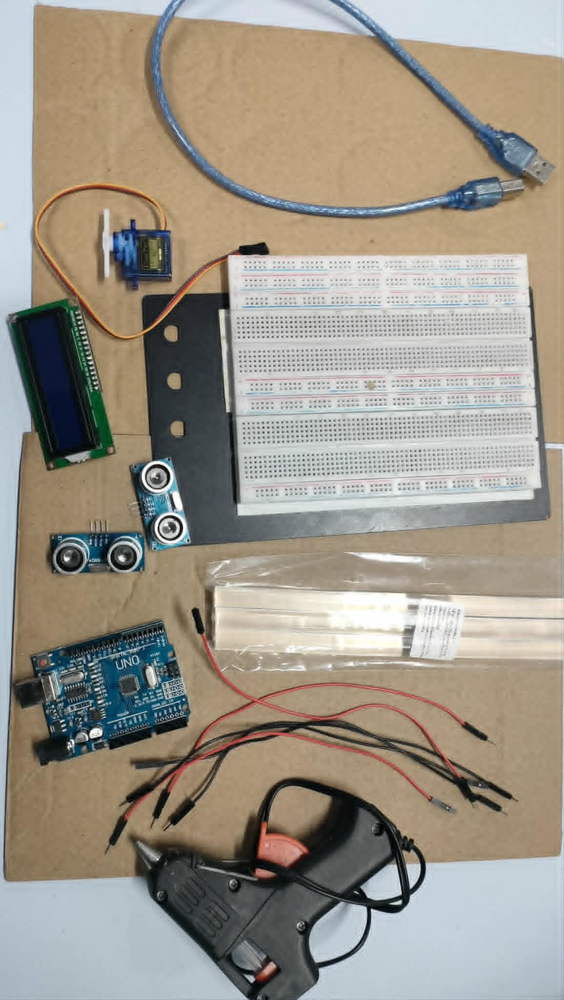
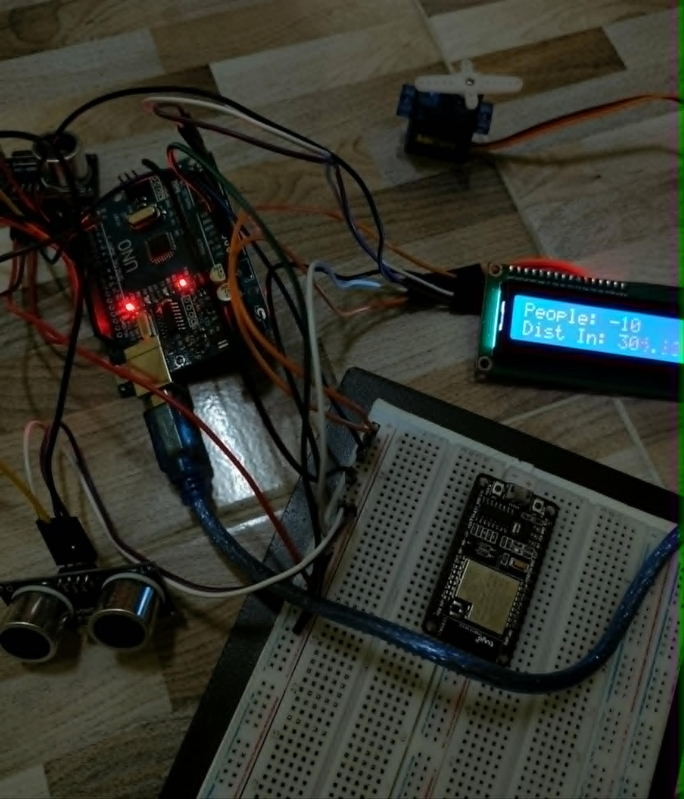

# 🚪 Automatic Door & People Counting System

An Arduino-based automatic door system that opens and closes the door automatically while counting the number of people entering and leaving a room.

---

## 📸 Project Preview

### Prototype

### Hardware Components

### System Testing

---

## ✨ Features

- 🚪 Automatic door opening and closing
- 👥 Real-time people counting
- 📡 Dual ultrasonic sensors
- 📺 LCD I2C display
- ⚙️ Servo motor control

---

## 🔧 Hardware

- Arduino UNO
- HC-SR04 Ultrasonic Sensor ×2
- Servo Motor
- LCD I2C 16×2
- Breadboard
- Jumper Wires

---

## 🛠 Software

- Arduino IDE
- C++

---

## 👨‍💻 Author

**Naseefa Salaeh**